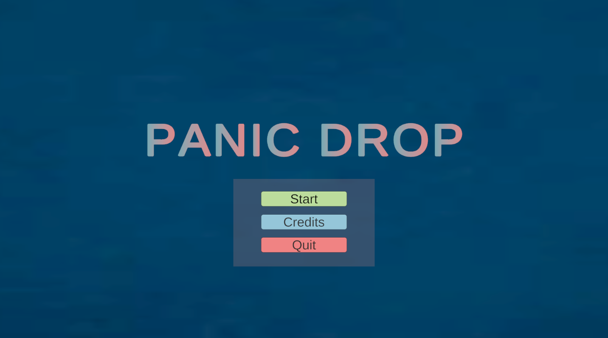

# Panic Drop

Panic Drop is a fast-paced, 2D dodging game where players test their reflexes by avoiding falling bombs 💣 and bullets 🔫 while collecting reward boxes 🎁 to boost their score. Survive as long as possible in this thrilling, action-packed challenge where the difficulty ramps up over time!


## 🎮 Gameplay

Objective:-

* Dodge falling bombs and bullets.

* Collect reward boxes to increase your score.

* Survive as long as possible to achieve the highest score!

Controls:-

* A / D or ← / →: Move the player left or right.

* ESC: Pause or resume the game.

Scoring:-

* Each reward box collected adds points to your score.

* Getting hit by a bomb or bullet ends the game.

## ⚡ Features

* Simple yet addictive gameplay: Easy to learn, hard to master.

* Increasing difficulty: The game gets faster and more challenging as time progresses.

* Reward system: Collect boxes to chase high scores.

* Pause/Resume functionality: Take a break without losing your progress.

## 🛠️ How to Play

* Download the release version
* Unzip the folder
* Open the 'Panic Drop.exe' and start playing!

## 🛠️ How to test the project

Clone or download the project:

```bash
    git clone https://github.com/biswarup-capsi/Panic-Drop.git
```

Open the project in Unity (2021.3 LTS or later recommended).

Press Play in the Unity Editor to start the game.

## 🚀 Future Improvements

* Power-ups: Introduce shields, speed boosts, or other exciting abilities.

* Multiple levels or waves: Add increasing difficulty stages.

* Leaderboard system: Compete with friends or globally.

* Audio enhancements: Implement sound effects and background music for a richer experience.
